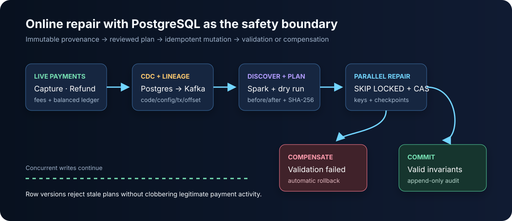
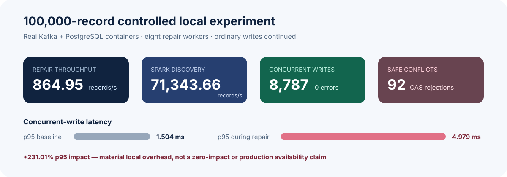
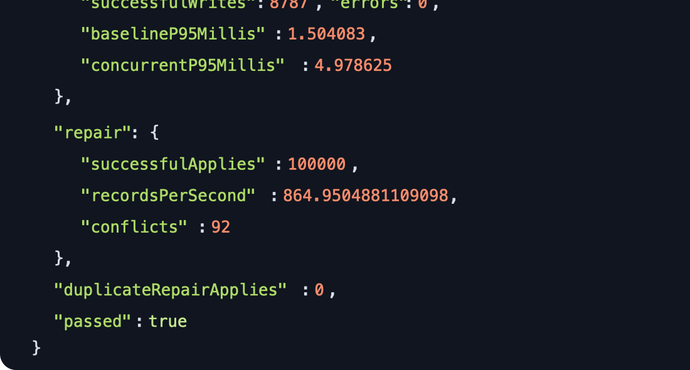
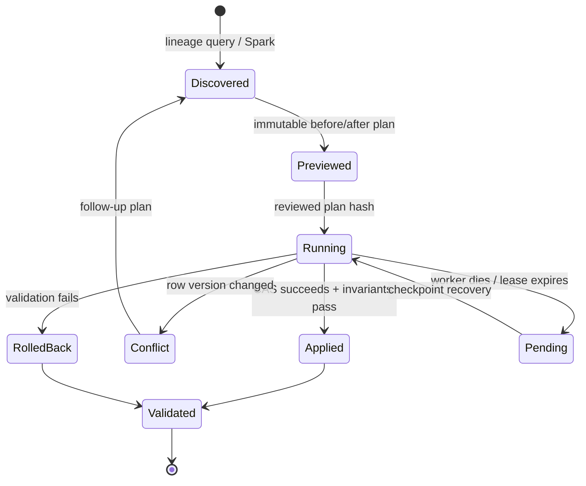
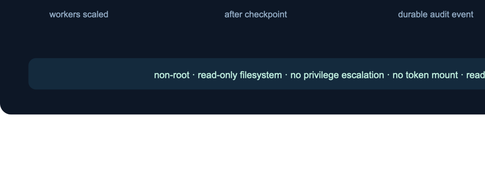

# Production Data Repair Engine

[](https://github.com/johnquevedo/production-data-repair-engine/actions/workflows/ci.yml)
[](LICENSE)
[](CHANGELOG.md)

A production-safety-oriented, open-source reference implementation for finding
and correcting corrupted payment records while ordinary application writes
continue. Built with Java, Kafka, PostgreSQL, Spark, and Kubernetes.

> **Evidence boundary:** this repository reports controlled local validation,
> not production deployment, external users, or zero downtime.



## The customer problem

An incorrect fee configuration can corrupt thousands of payments, ledger
entries, and downstream events before a team detects it. A one-off SQL update
is fast but unsafe: it cannot reliably identify provenance, preview all effects,
coordinate with live writes, resume after failure, prove each mutation happened
once, or compensate a bad repair.

This engine treats repair as a durable workflow. It identifies records from
immutable event lineage, persists a reviewable plan, updates each record with
optimistic concurrency control, validates payment and ledger invariants inside
the transaction, and records an append-only audit trail.

## Measured result



In the final controlled local Kafka/PostgreSQL experiment:

| Signal | Measured value |
|---|---:|
| Corrupted payments repaired | **100,000** |
| Repair throughput | **864.95 records/second** |
| Spark affected-record discovery | **71,343.66 records/second** |
| Ordinary writes completed during plan/repair | **8,787** with 0 errors |
| Safely handled compare-and-swap conflicts | **92** |
| Duplicate repair applications | **0** |
| Baseline concurrent-write p50 / p95 | 0.857 ms / **1.504 ms** |
| During-repair p50 / p95 | 2.673 ms / **4.979 ms** |
| Measured p50 / p95 increase | +211.85% / **+231.01%** |

The latency increase is material and explicitly rules out a “zero impact”
claim. Repair throughput is worker time; it excludes seeding, CDC ingestion,
and discovery. The scale run and separate 5,000-record hard-fault/Kind runs
were conducted locally on macOS arm64, not in production.



Every headline number maps to a checked-in machine report in
[`evidence/`](evidence/) and the claim-by-claim
[`RECRUITING_SPEC.md`](RECRUITING_SPEC.md).

## Architecture

1. **Payment workload** atomically writes authorization, capture, refund,
   fee, balanced ledger entries, and an outbox event.
2. **CDC relay** publishes outbox events to Kafka with at-least-once delivery.
3. **Lineage consumer** idempotently records event ID, payment ID, source
   transaction, code/config version, Kafka partition/offset, and payload.
4. **Spark discovery** queries the implicated configuration version and writes
   the affected set to partitioned Parquet.
5. **Planner** rechecks live rows, creates before/after images, and persists a
   SHA-256-addressed dry-run plan.
6. **Workers** claim partitions with `FOR UPDATE SKIP LOCKED`, apply
   deterministic repair keys, and advance durable checkpoints.
7. **Safety boundary** uses a row-version compare-and-swap, in-transaction
   validation, append-only audit records, and compensating rollback.

See [`docs/ARCHITECTURE.md`](docs/ARCHITECTURE.md) for the schema and transaction
boundaries.

## Repair lifecycle



## Safety mechanisms

- Transactional-outbox CDC and event-ID uniqueness make duplicate delivery safe.
- Immutable lineage attributes a record to code/configuration and source transaction.
- Dry runs expose exact before/after images without repair mutations.
- Plan hashes prevent unnoticed changes between review and execution.
- Deterministic repair keys and database uniqueness prevent double application.
- Parallel workers use durable item state, partition checkpoints, and stale-claim recovery.
- Row-version compare-and-swap refuses to overwrite concurrent captures/refunds.
- Payment state and balanced-ledger invariants are checked before commit.
- Validation failure triggers per-record compensating rollback.
- Database triggers enforce append-only audit history.
- Kubernetes workers run non-root with a read-only root filesystem, dropped
  capabilities, no privilege escalation, no service-account token, and a real
  readiness probe.

## Recovery evidence

The separate hard-fault experiment forcibly SIGKILLed a worker, restarted Kafka
twice, restarted PostgreSQL once, and redelivered events. It resumed
automatically from checkpoints and finished 5,000/5,000 repairs with four
retries, zero duplicate applications, and zero wrong fees.

The disposable Kind experiment scaled to four ready worker pods, force-deleted
one ready pod after checkpoints existed, observed five distinct worker
identities, recorded crash recovery after 12 seconds, and completed 5,000/5,000
repairs once.



## Quick reproduction

Requirements: Docker with Compose, Maven 3.9+, JDK 17+, and `kubectl`.

```bash
git clone https://github.com/johnquevedo/production-data-repair-engine.git
cd production-data-repair-engine

# Fast build and unit suite
mvn -Dgroups='!integration' verify

# Real Kafka/PostgreSQL integration suite
./scripts/run-integration-tests.sh

# Controlled baseline experiment
./scripts/run-experiment.sh --records 1000 --workers 8

# Offline Kubernetes render/security checks
./scripts/test-kubernetes.sh
```

The full recruiting-scale experiment is intentionally separate because it
takes several minutes and uses substantial local resources:

```bash
./scripts/run-scale-experiment.sh
docker compose --profile spark run --rm spark-discovery
```

Hard process/service faults:

```bash
./scripts/run-fault-injection.sh
```

Local Kind end-to-end (requires a Kind v0.27+ binary at `.tools/kind`):

```bash
mkdir -p .tools
curl -Lo .tools/kind https://kind.sigs.k8s.io/dl/v0.27.0/kind-darwin-arm64
chmod +x .tools/kind
./scripts/run-kind-e2e.sh
```

On Linux, replace the Kind download suffix with `kind-linux-amd64` or the
appropriate published architecture. Experiment scripts write scratch reports
to ignored `build/reports/`; compare them with the curated
[`evidence/`](evidence/) files.

## Tests

| Layer | What it covers |
|---|---|
| Unit | monetary snapshots, fee corrections, invalid states |
| Real-service integration | payment lifecycle, CDC lineage, duplicate delivery, dry-run immutability, idempotency, checkpoints, concurrent-write conflicts, rollback, audit immutability |
| Fault injection | worker SIGKILL, Kafka/PostgreSQL restarts, redelivery, checkpoint interruption |
| Kubernetes | manifest render, security settings, readiness, scaling, pod termination recovery, successful completion |

CI runs the Java build/unit suite, real Kafka/PostgreSQL integration suite, and
Kubernetes manifest/security checks. The heavyweight Kind workflow is available
for explicit manual execution.

## Limitations

- CDC uses a transactional-outbox relay, not PostgreSQL logical decoding/Debezium.
- Kafka and PostgreSQL each use one local instance; broker replication,
  PostgreSQL HA/failover, and network partitions were not tested.
- Automatic rollback is per record; job-wide reversal is not implemented.
- Full settlement, disputes, chargebacks, PCI controls, encryption,
  retention/redaction, approval UI, metrics, and tracing are out of scope.
- Full before-images are retained in this reference implementation.
- The measurements describe one controlled local machine and are not general
  capacity, availability, production, external-adoption, or zero-downtime claims.

Exact next steps and unsupported scope are recorded in
[`docs/EXPERIMENT_RESULTS.md`](docs/EXPERIMENT_RESULTS.md).

## Publication integrity

The pre-publication credential, PII, large-file, generated-output, and artifact
review is documented in [`AUDIT.md`](AUDIT.md). Local credentials are disposable
test values only; Kubernetes production credentials must come from a secret
manager.

Apache-2.0 licensed. See [`LICENSE`](LICENSE), [`SECURITY.md`](SECURITY.md), and
[`CONTRIBUTING.md`](CONTRIBUTING.md).
